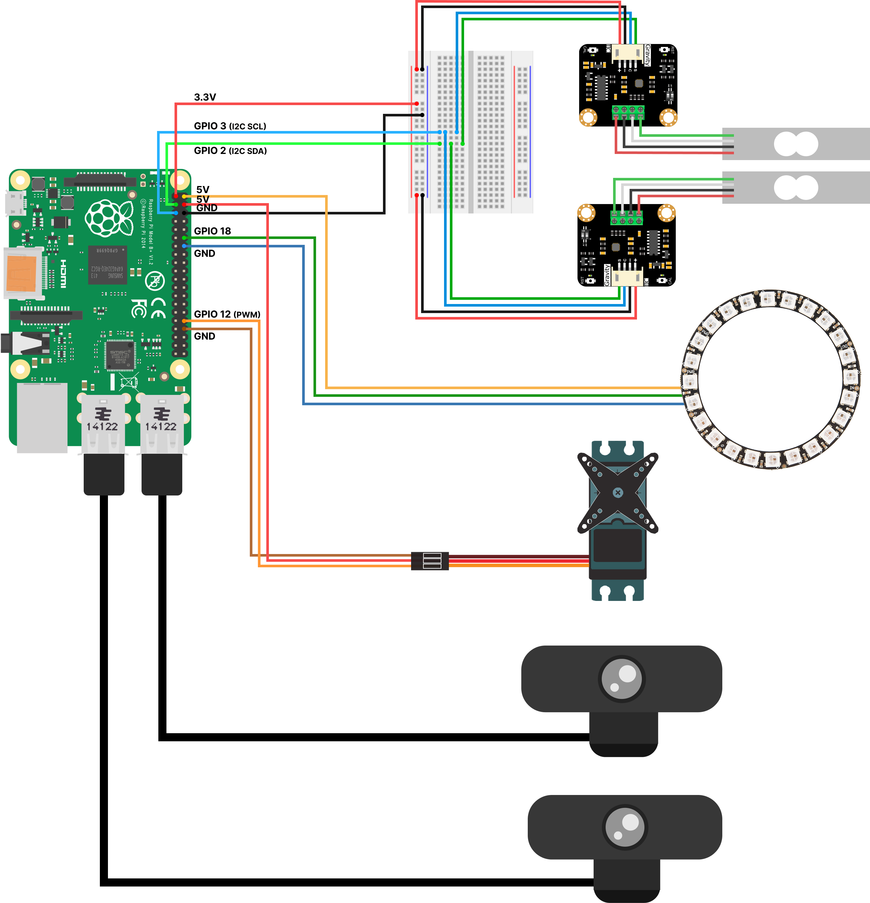
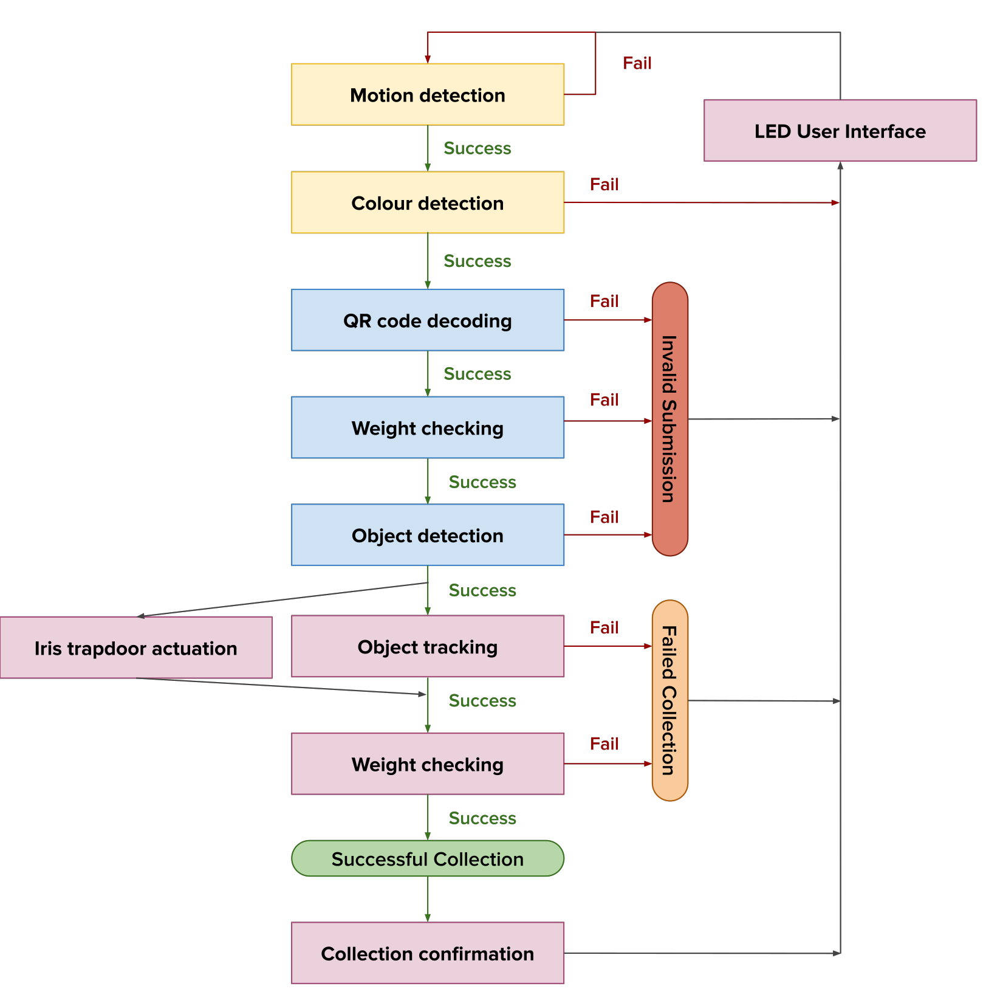

# EIE MEng Final Year Project - Computer vision for zero-waste food containers

This repository contains the final software to be run on the Raspberry Pi 4B.

## Software requirements

This code was developed in Python 3.9 and exact package dependencies can be found in [`requirements.txt`](./requirements.txt).

Alternatively, the Raspberry Pi can be configured and dependencies can be installed using the provided [`setup.sh`](./setup.sh) script. Then, the software can be run using the [`start.sh`](./start.sh) script. (*Note: this will install all Python dependencies in a VirtualEnv for easy package management.*)

## Wiring diagram

The hardware components should be connected to the Raspberry Pi 4 Model B as follows:

## Software system diagram

The software system operates as follows:

